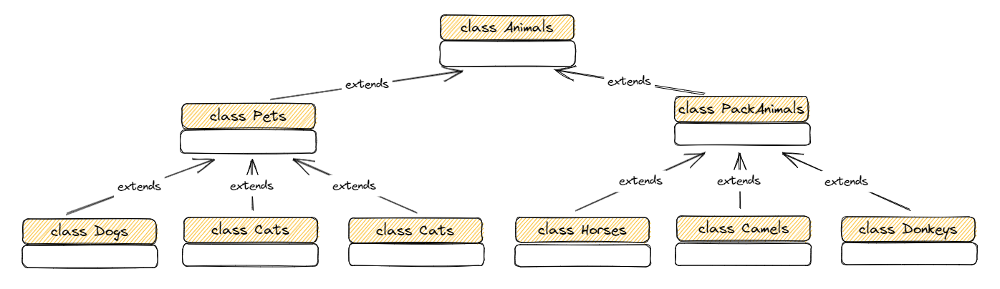

# Итоговая аттестация по блоку специализация
* **
### Автор проекта:
Деревянных Алексей
* **
## *Задание по Linux*
* **
1. Используя команду cat в терминале операционной системы Linux, создать
   два файла Домашние животные (заполнив файл собаками, кошками,
   хомяками) и Вьючные животными заполнив файл Лошадьми, верблюдами и
   ослы), а затем объединить их. Просмотреть содержимое созданного файла.
   Переименовать файл, дав ему новое имя (Друзья человека).
````bash
aleksey@ubuntu-gb:~/gb$ cat > 'Домашние животные'
собаки
кошки
хомяки
aleksey@ubuntu-gb:~/gb$ cat > 'Вьючные животные'
Лошади
верблюды
ослы
aleksey@ubuntu-gb:~/gb$ cat 'Домашние животные' 'Вьючные животные' > 'Животные'
aleksey@ubuntu-gb:~/gb$ cat 'Животные'
собаки
кошки
хомяки
Лошади
верблюды
ослы
aleksey@ubuntu-gb:~/gb$ mv 'Животные' 'Друзья человека'
````
2. Создать директорию, переместить файл туда.
````bash
aleksey@ubuntu-gb:~/gb$ mkdir animals
aleksey@ubuntu-gb:~/gb$ mv 'Друзья человека' animals/'Друзья человека'
aleksey@ubuntu-gb:~/gb$ ls -la animals
total 12
drwxrwxr-x 2 aleksey aleksey 4096 Apr 11 14:10  .
drwxrwxr-x 3 aleksey aleksey 4096 Apr 11 14:10  ..
-rw-rw-r-- 1 aleksey aleksey   76 Apr 11 13:08 'Друзья человека'
````
3. Подключить дополнительный репозиторий MySQL. Установить любой пакет
   из этого репозитория.
````bash
aleksey@ubuntu-gb:~/gb$ sudo apt-key adv --keyserver pgp.mit.edu --recv-keys 3A79BD29
aleksey@ubuntu-gb:~/gb$ sudo echo 'deb http://repo.mysql.com/apt/ubuntu/ bionic mysql-8.0' > /etc/apt/sources.list.d/mysql.list
aleksey@ubuntu-gb:~/gb$ sudo apt update
Hit:1 http://ru.archive.ubuntu.com/ubuntu jammy InRelease
Hit:2 http://ru.archive.ubuntu.com/ubuntu jammy-updates InRelease
Hit:3 http://repo.mysql.com/apt/ubuntu bionic InRelease
Hit:4 http://ru.archive.ubuntu.com/ubuntu jammy-backports InRelease
Hit:5 http://ru.archive.ubuntu.com/ubuntu jammy-security InRelease
Reading package lists... Done
Building dependency tree... Done
Reading state information... Done
All packages are up to date.
aleksey@ubuntu-gb:~/gb$ sudo apt install mysql-common
Reading package lists... Done
Building dependency tree... Done
Reading state information... Done
The following NEW packages will be installed:
  mysql-common
0 upgraded, 1 newly installed, 0 to remove and 0 not upgraded.
Need to get 69.3 kB of archives.
After this operation, 91.1 kB of additional disk space will be used.
Get:1 http://repo.mysql.com/apt/ubuntu bionic/mysql-8.0 amd64 mysql-common amd64 8.0.32-1ubuntu18.04 [69.3 kB]
Fetched 69.3 kB in 0s (462 kB/s)
Selecting previously unselected package mysql-common.
(Reading database ... 74006 files and directories currently installed.)
Preparing to unpack .../mysql-common_8.0.32-1ubuntu18.04_amd64.deb ...
Unpacking mysql-common (8.0.32-1ubuntu18.04) ...
Setting up mysql-common (8.0.32-1ubuntu18.04) ...
update-alternatives: using /etc/mysql/my.cnf.fallback to provide /etc/mysql/my.cnf (my.cnf) in auto mode
Scanning processes...
Scanning linux images...

Running kernel seems to be up-to-date.

No services need to be restarted.

No containers need to be restarted.

No user sessions are running outdated binaries.

No VM guests are running outdated hypervisor (qemu) binaries on this host.
aleksey@ubuntu-gb:~/gb$
````
4. Установить и удалить deb-пакет с помощью dpkg.
````bash
aleksey@ubuntu-gb:~/gb$ apt download lftp
Get:1 http://ru.archive.ubuntu.com/ubuntu jammy/main amd64 lftp amd64 4.9.2-1build1 [720 kB]
Fetched 720 kB in 0s (3,197 kB/s)
aleksey@ubuntu-gb:~/gb$ sudo dpkg -i lftp_4.9.2-1build1_amd64.deb
(Reading database ... 74009 files and directories currently installed.)
Preparing to unpack lftp_4.9.2-1build1_amd64.deb ...
Unpacking lftp (4.9.2-1build1) over (4.9.2-1build1) ...
Setting up lftp (4.9.2-1build1) ...
Processing triggers for man-db (2.10.2-1) ...
aleksey@ubuntu-gb:~/gb$ sudo dpkg -r lftp
(Reading database ... 74009 files and directories currently installed.)
Removing lftp (4.9.2-1build1) ...
Processing triggers for man-db (2.10.2-1) ...
aleksey@ubuntu-gb:~/gb$
````
5. Выложить историю команд в терминале ubuntu.
````bash
aleksey@ubuntu-gb:~/gb$ history
    1  cat > 'Домашние животные'
    2  cat > 'Вьючные животные'
    3  cat 'Домашние животные' 'Вьючные животные' > 'Животные'
    4  cat 'Животные'
    5  mv 'Животные' 'Друзья человека'
    6  mkdir animals
    7  mv 'Друзья человека' animals/'Друзья человека'
    8  ls -la animals
    9  sudo apt-key adv --keyserver pgp.mit.edu --recv-keys 3A79BD29
   10  sudo echo 'deb http://repo.mysql.com/apt/ubuntu/ bionic mysql-8.0' > /etc/apt/sources.list.d/mysql.list
   11  sudo apt update
   12  sudo apt install mysql-common
   13  apt download lftp
   14  sudo dpkg -i lftp_4.9.2-1build1_amd64.deb
   15  sudo dpkg -r lftp
   16  history
aleksey@ubuntu-gb:~/gb$
````
* **
## *Задание по базам данных*
* **
6. Нарисовать диаграмму, в которой есть класс родительский класс, домашние
   животные и вьючные животные, в составы которых в случае домашних
   животных войдут классы: собаки, кошки, хомяки, а в класс вьючные животные
   войдут: Лошади, верблюды и ослы).
   
7. В подключенном MySQL репозитории создать базу данных “Друзья
   человека”
```sql
CREATE DATABASE `mans_friends` ;
```
* **
## *Приложение система учёта питомника (Java)*
* **
